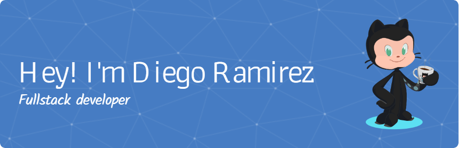

- 🔭 I’m currently **Studying Systems and Computer Engineering at the National University of Colombia**
- 🌱 I’m currently learning **Golang**
- 💬 Ask me about **[Chess](https://lichess.org/@/diegoramirez1312), [React](https://react.dev/)**

<h2 align="center">📫 How to reach me</h2>

  
  &nbsp;
  
  &nbsp;
  
  &nbsp;
  

  

<h2 align="center">📊 Statistics</h2>

  
  

<h2 align="center">🚀 Some Tools & Technologies I Use</h2>

  

